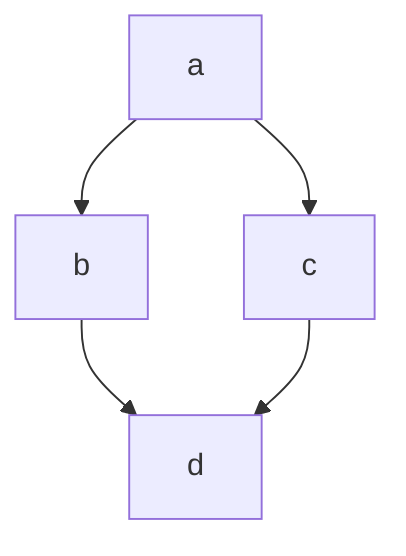

# markdown

# titulo 
## titulo 
### titulo 
#### titulo 
##### titulo 
###### titulo 

Parágrafo 

Se você der espaços 
entre linha, então você 
terá um novo parágrafo.

Quebra de linha 
com dois espaços 
ao final da linha.<br> é o mesmo <br> que você encontra no html

**negrito**
__negrito__
==marcado==
_sublinhado 
sublinhado
~~riscado~~
_italico_

Em um **parágrafo** podemos usar todos os anteriores 

## Listas 

1. ordenadas 
    1. subitem
    1. outro subitem
    1. outro subitem
2. quando você usa um número, o 
3. próximo item será automaticamente incrementados 
    1. subitem
    1. outro subitem
    1. outro subitem

- Não ordenadas 
* Você pode usar um astrerisco ou hifen 
+ Sinal de mais tambem é aceito

- Não ordenadas 
- Quando escolhe umas delas para usar elas ficam alinhadas na linha sem o espaço evidente 

- Não ordenadas 
- Você pode usar um astrerisco ou hifen 
- Sinal de mais tambem é aceito
-O correto é não misturar os sinais 

## Links 

 [Texto](https://google.com)

[Clique aqui](https://senac.br/)
[Clique aqui](https://github.com/Brunolopessobral/)

[ancora](#markdown)
[listas](#listas)
Aqui é um parágrafo com o link [Clique aqui](https://senac.br/ "Titulo para esse link") ou aqui é um parágrafo com um link https://senac.br/

[Clique aqui](https:///senac.br/ "Site senac") ou aqui é um paragrafo com um link https://senac.br/

## imagem 


## Timão 


## Imagem com link
[[(]](https://www.doearenacorinthians.com.br/)

[](https://gmail.com)

[](https://github.com/Brunolopessobral)

## citação

> Iniciar minha citação 

> <br>
> Iniciar minha citação 
> <br><br>

> Citação
>> sub citação
>### Titulo dentro de uma citação

## toggle

<details>
    <summary>
    Clique aqui para ver o conteúdo
    </summary>
    Conteúdo
</details>

## separador 

pode ser 3 traços

---

ou pode ser 3 asteriscos 

***

## checklist

- [ ] Item 1
- [x] Item 2
- [ ] Item 3
- [x] Item 4
- [ ] Item 5

## Para poder copiar uma linha de cima mais rapido aperte shift e alt e a setinha para baixo ou para cima!!


## tabela 

| nome   | idade   |
| ----   |  ----   |
| Bruno  |   16    |
| Sophie |    7    |


| nome   | idade   |
| ----   | ----:   |
| Bruno  |   16    |
| Sophie |    7    |


| nome     | idade   |
| :----:   | :----:  |
| Bruno    |   16    |
| Sophie   |    7    |


## código

Em linha usamos 1 acento grave para abrir o código e outro para fechar 

` <h1> Eu sou um título</h1> `

<h1> Eu sou um título</h1> 
 
` # Eu sou um título`

# Eu sou um título

` console.log('Olá, mundo!')`

### bloco de código

Usaremos 3 acentos graves para abrir, seguindo da linguagem que eu quero, e para fechar mais 3 acentos graves.

``` html 

<details>
    <summary>
    Clique aqui para ver o conteúdo
    </summary>
    Conteúdo
</details> 

 ```


``` css

.container{
    display:flex;
}

```

``` javascript

console.log('Olá, mundo!');

function dados(dados){
    console.log(dados);
}

``` 

## emojis 

:rocket:
:smirk:
:elephant:

:s

:D



<!-- Comentário -->